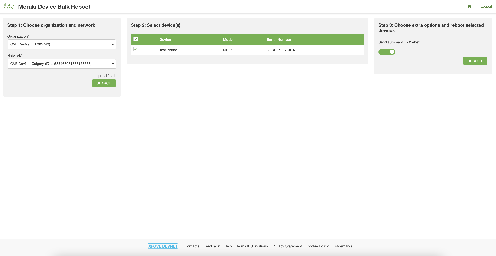

Meraki Device Bulk Reboot
=====================================
Meraki has a broad portfolio including routers, switches, Access Points (APs), cameras and sensors. The Meraki cloud is the backbone of the highly available, secure, and efficient Meraki solution. It allows for easy management and provisioning of the devices. Moreover, all the products and solutions are programmable, which allows us to build customization and integrations. In this Proof of Value (PoV), we have created an intuitive user interface which can easily reboot all selected APs. 

In larger networks, there might be a lot of Access Points. Sometimes, it could happen that an AP doesn't work correctly, but it's unclear exactly which AP is causing the problem. The simple user interface that we have created ensures that rebooting all APs doens't have to happen manually anymore. Instead, it can be done with a single button click. This app, therefore, makes it much faster and easier to reboot all Access Points and fix the problem.

Once a user selects a organization and a network, a table containing all APs in the network will be shown. All of these APs are selected by default to be rebooted. However, it is possible to deselect APs, should that be necessary. Afterwards, it's simply a matter of clicking the 'reboot' button to reboot all selected APs. Once the rebooting process is finished, the user will receive a summary of the results (whether the reboot was successful or a failure for each of the APs).

In addition to receiving a summary within the user interface itself, there is also an option to send this summary to Webex as well. This option is selected by default, but can be deselected, if desired.

In summary, the user interface has the following functionalities:

* Rebooting of all selected Access Points
* Generate a summary of the results of the rebooting process
* Send an additional summary of the results to Webex

## White Paper
Provide links to related white papers:
* [Meraki MR product family datasheet](https://meraki.cisco.com/product-collateral/mr-family-datasheet/?file)

## Related Sandbox
Provide a link to a related DevNet Sandbox:

* [Meraki Always On](https://devnetsandbox.cisco.com/RM/Diagram/Index/a9487767-deef-4855-b3e3-880e7f39eadc?diagramType=Topology)

## Links to DevNet Learning Labs
Provide links to related Learning Labs or modules on DevNet:

* [Meraki Dashboard API](https://developer.cisco.com/learning/lab/meraki-02-dashboard-api/step/1)

## Solutions on Ecosystem Exchange
Provide links to related solutions on DevNet Ecosystem Exchange:

* [More flexibility to run batch configuration change](https://developer.cisco.com/ecosystem/meraki/apps/603579b41e36356141486cb9/)
* [Bluetooth-based asset tracking](https://developer.cisco.com/ecosystem/meraki/apps/5c01bea334861343dd555098/)